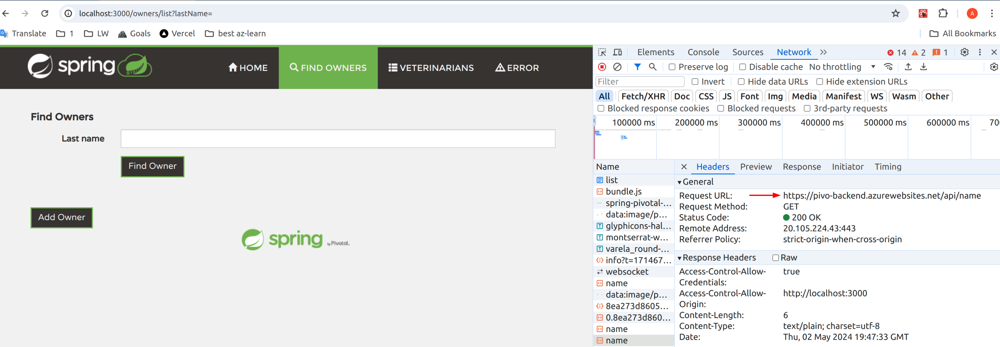

# PivoBackend
цель проекта: научиться связывать бэк и фронт и деплоить их в облако Azure

пробовала залить в azure разными способами
1) сама создавала docker контейнеры и Dockerfile и пушила напрямую в acr (azure container registry)
2) используя CI/CD: GithubActions + Azure AppService 

репы которые заливала в azure\
бэк:  https://github.com/AnnaEleeva/Pivo\
фронт:  https://github.com/AnnaEleeva/PivoFrontend (учила React + JavaScript)

